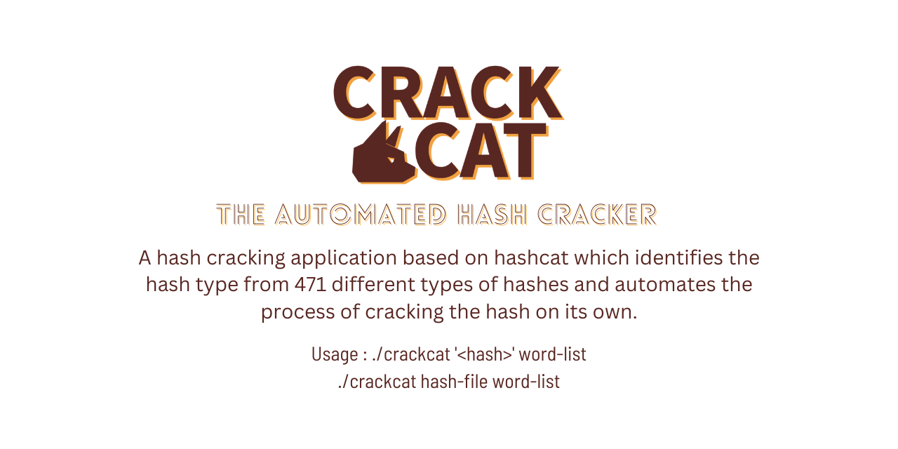

# crackcat

## Requirements:
- Hashcat (https://github.com/hashcat/hashcat) (sudo apt-get install hashcat)
- Haiti (https://github.com/noraj/haiti/) (Required only for crackcatmod)
- rockyou.txt Is the default wordlist to be used, Can be edited for using a different word-list.

## Usage : 
$ ./crackcat <hash_to_be_cracked> wordlist-file

If you have the rockyou.txt file in /usr/share/wordlists, the wordlist-file is optional, If you want to use the default wordlist for cracking hashes run the requirements.sh script with sudo permission.
